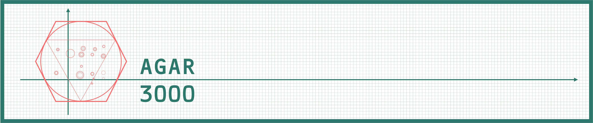
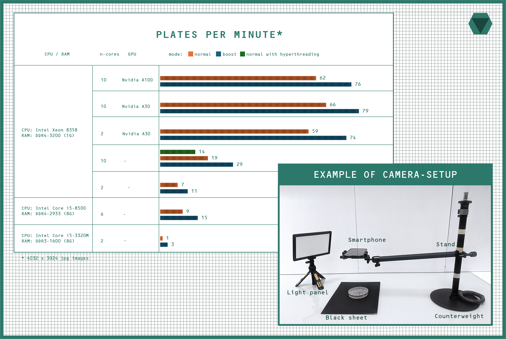
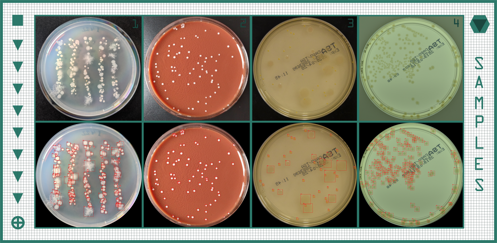

**Yes, it's an AI!**

A tool that automatically detects and counts colonies on images of agar plates.

Think automated colony counting isn't for you 🤨? Your plates are too "wild" for a machine?
Take a photo with your smartphone and let agar3000 prove you wrong.


- No fine-tuning  or supervision required. Just an input path with your images and an output path for the results
- It can analyse up to 20 images per minute in CPU-only mode and up to 65 with GPU acceleration.


## Requirements
<details>
  <summary markdown="span">Click to expand</summary>

### Images
1. Photos may be captured using any camera, including **a smartphone camera**.
2. Images should be taken against a uniform background and under adequate lighting. The plate must be in sharp focus, and occupy the majority of the image (at least two-thirds of the shorter side of the image) and be in sharp focus.
3. Condensation, glare, and other imperfections on the plate's lid may lead to inaccurate results. The tool has some tolerance for bubbles in the media.
4. The tool may have difficulty detecting very small colonies, colonies with complex structures, or colonies grown on unusually looking media.
5. The recommended minimum image resolution is 2048 × 2048 pixels. Higher resolutions do not affect the results, as images are downscaled internally.
6. Supported image formats are JPG, PNG, TIFF, BMP (any formats supported by **opencv**)

### Hardware
agar3000 runs on any x86-based system with **Windows or Linux** and uses up to 1G of RAM. It works without a GPU but can also utilise a GPU to significantly accelerate computations.

- **NVIDIA GPUs** are supported via CUDA (with cuDNN), starting from the Maxwell architecture onwards (e.g., GTX 780 Ti, GTX 900 series and above), on both Linux and Windows systems.
- **AMD GPUs** are supported via ROCm, starting from the Vega architecture onwards (e.g., RX Vega, RX 5000 series and newer), on Linux only.


</details>


## Getting started
agar3000 requires **python** (>v3.6) with **opencv** and **onnxruntime** packages. We recommend to use environment management system such as conda for installation: https://www.anaconda.com/download/

```bash
conda create -n agar3000 python
conda activate agar3000
```

### CPU-mode:
The CPU-mode is the simplest way to install, test and use agar3000, provided that slower inference is acceptable.

```bash
pip install opencv-python onnxruntime
```

### GPU-mode:

Setting up GPU mode can be difficult, and we recommend it only when inference speed is essential.

GPU inference requires matching of GPU, [CUDA+cuDNN](https://developer.nvidia.com/cuda/) (for NVIDIA GPUs) or [ROCm](https://www.amd.com/en/products/software/rocm.html) (for AMD GPUs), OS, python and onnxruntime versions. 

For Nvidia GPU inference with CUDA 12.x + cuDNN 9.x, try:

```bash
pip install opencv-python onnxruntime-gpu 
```

For AMD GPU inference with ROCm 7.0, try:

```bash
pip install opencv-python onnxruntime-rocm 
```

Note that _onnxruntime-gpu_ and _onnxruntime-rocm_ will fall back to CPU-mode if GPU setting up failed. 

For other versions of CUDA and ROCm see corresponding compatibility tables:

[CUDA](https://onnxruntime.ai/docs/execution-providers/CUDA-ExecutionProvider.html#requirements)

[ROCm](https://onnxruntime.ai/docs/execution-providers/ROCm-ExecutionProvider.html#requirements)

## Workflow

```bash
python agar3000.py input_path output_path [-t] [-b] [-h] [--no-crop] [--extra] 
```

#### Main arguments:

* `input_path`: path to the folder with images of plates. Non-recursive: files in subfolders are not processed. Input_path can be a single image file.
* `output_path`: path to the folder where results are saved. The folder is created if it does not exist.

#### Optinal flags:

* `-t`: trans-illumination mode. Uses a different model trained to detect colonies on trans-illuminated plates (see images 3 and 4 in the examples below).
* `-b`: increases inference speed with a marginal change in counting precision. 
* `--no-crop`: skips image cropping. Useful if cropping fails or the plates are not circular.
* `--extra`: saves intermediate processing stages as images and tables (cropped images, tiles before deduplication and tiles after deduplication). Significantly slows down inference. Recommended only for testing

#### Results include:
The output folder contains:
- an image of each plate with boxes drawn around the colonies
- a CSV file with the annotations for each plate
- RESULTS.csv with the number of colonies for each plate
- a log file, agar3000_[timestamp].log
  

For a first run, we recommend testing the tool on a single image or running the included demo:

```bash
python agar3000.py demo demo/results
```    
for trans-illuminated plates:
```bash
python agar3000.py demo_t demo_t/results
```    



## Pipeline (TBD)

## QnA

**Which side of the plate should be photographed?**

The lid side. Position the plate so that the lid faces the camera. The model was trained and tested only on images captured from this side, ensuring optimal accuracy.

**What should I do if there is condensation under the lid?**

To open the lid before photographing is the simplest approach to this problem. Condensation can obscure colonies and interfere with detection. If sterility is required, open the lid in laminar flow.

**Which lighting of the plate is an adequate one?**

The light must be homogeneous to prevent reflection artefacts. We used an LED panel with a diffuser.

**What is trans-illumination and is it better?** 

Trans-illumination refers to illuminating a transparent plate from behind, causing colonies to appear as darker features against a lighter background. In our tests, we found no evidence that this illumination method provides any benefit. For plates photographed this way, use the -t flag.


**What is the minimum detectable colony size?**

Colonies must be at least 8 px in diameter. Actual performance may depend on several factors, so we recommend checking the results if you have any doubts.


**Which media count as unusual-looking?**
agar3000 was tested on several media. Precision dropped on some plates with non-standard colours, such as blood agar and chocolate agar. Performance on such media may depend on colony morphology and is not guaranteed.  

**What is the optimal number of colonies per plate?**
We recommend 10–300 colonies per plate for good precision. However, the theoretical maximum is 1,600 colonies per plate.

**How the colour depth may influence analysis?**
TBD


**Does hyper-threading improve inference speed?**

No. In our tests, hyper-threading slowed down inference. We recommend disabling hyper-threading if this option is available for your computational setup. 


## License

- **Code:** MIT (see LICENSE file)
- **Model weights:** CC BY-NC 4.0 — non-commercial use only

## References
The models were trained using [MMDetection](https://github.com/open-mmlab/mmdetection) and the AGAR dataset introduced in:

Majchrowska, S., Pawłowski, J., Guła, G., Bonus, T., Hanas, A., Loch, A., Pawlak, A., Roszkowiak, J., Golan, T., and Drulis-Kawa, Z.
“AGAR: A Microbial Colony Dataset for Deep Learning Detection” (2021).

Dataset source: https://agar.neurosys.com/

We gratefully acknowledge the authors and contributors for making this dataset publicly available.

Special thanks to @dedovskaya for sharing the model used during the early development: https://github.com/dedovskaya/CFUCounter

---
If agar3000  was useful for you, don't forget to recommend it to your colleagues and mention it in your publications. Thanks for testing!
