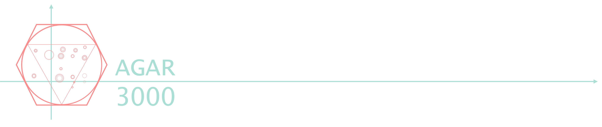
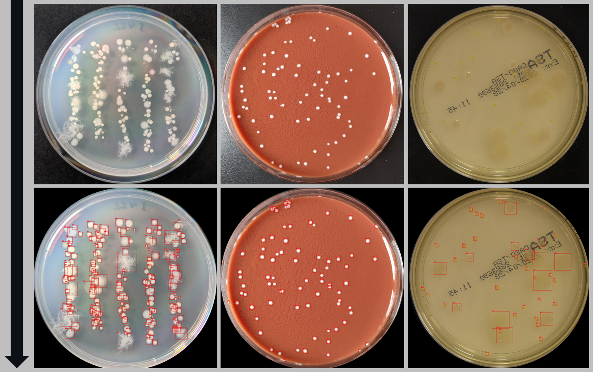
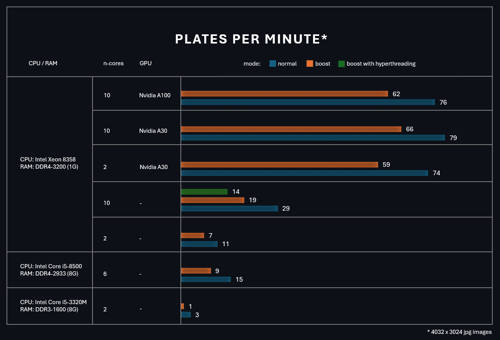

An application that automatically detects and counts colonies on images of agar plates.

Do you think that automated colony counting isn't for you🤨? Are your plates too tough for a machine?!  Try our new agar3000! 

# Get started
Agar3000 requires python
1. Download: Code > Download ZIP
2. Unpack
3. Download .h5 file from this link: https://drive.google.com/file/d/19-mxrjV_EeSQAb7SppIVG_vgjse_pP7u/view?usp=sharing
4. Put .h5 file to "CFUCounter/agar_cfg20221010T2320" folder
5. Download and install conda (if lacks): https://www.anaconda.com/download/success
6. Open Anaconda Prompt
7. Create a conda environment with Python 3.6.3:

&emsp;&emsp; *conda create -n agarrcnn python=3.6.3*

&emsp;&emsp; *conda activate agarrcnn*

8. Install requirements: go to unpacked folder

&emsp;&emsp; *pip install -r requirements.txt*

# How to use?

&emsp;&emsp; *python demo.py*

test_data is used for the demo. Otherwise, specify the path to the folder containing the photos of plates. All other arguments are accessible through the CONFIG section of agarrcnn.py.

After the initial preprocessing, the program halts allowing you to check the intermediate results. It's important, since the next step can be very time-consuming. Press 'y' if you are ready to continue and wait untill it's done.

# Results
Since the package is in development phase we save and visualize all relevant information for debuging. Results can be found in a dedicated folder inside original images folder.  Each photo of a plate results:

### preprocessing
ori_***.jpg -> original image

cropped_***.jpg -> cropped image

thr_***.jpg -> thresholded image(for proper spliting)

splits_***/ -> folder with splits of image and possitioning file

### colonies detection and feature extruction
results_***.csv -> all numerical results see description below

results_\*\*\*.png -> image of plates reconstructed by using data from results_***.csv

### stripes detection
***_kmean_plot.png -> results of kmean on pc1 stripes detection

***_pol_plot.png -> results of fiting a mixture of polynomial regression

### summary
Can be find in the root folder *results/*

all_results.csv
validation.html -> comparison of demo-results (number of colonies) with validation values (manual counting)

## Content of *results.csv*
1. **Label:** colony index (sequence of natural numbers)
2. **Rois:** coordinates of box inclosing colony 
3. **Mask:** binary mask of colony
4. **X,Y:** coordinates of center
5. **Area:** area in pixels; derived from mask
6. **R,G,B:** average colore of colony (masked region)
7. **Stripe:** stripe according to initiial spliting
8. **Stripe_Kmean:** according to k-means on PC1 clustering
9. **Stripe_Polreg:** according to mixture of polynomial regressions

# Limitations

## License

- **Code:** MIT (see LICENSE file)
- **Model weights:** CC BY-NC 4.0 — non-commercial use only

Commercial use of the model weights requires a separate 
agreement with the training dataset authors: https://agar.neurosys.com/

# Referances
