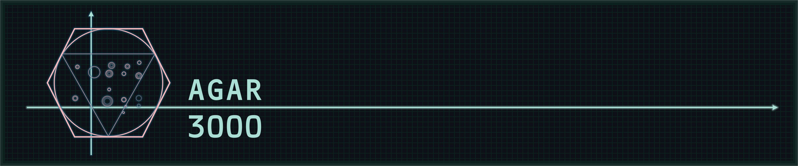
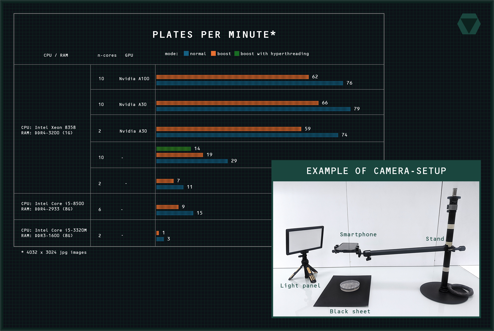
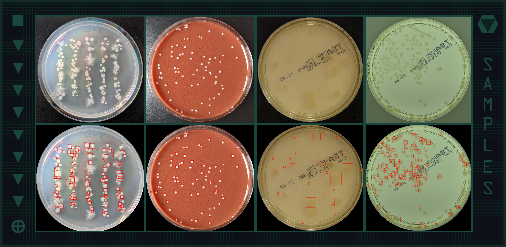

A tool that automatically detects and counts colonies on images of agar plates.

Think automated colony counting isn't for you 🤨? Your plates are too "wild" for a machine?
Take a photo with your smartphone and let agar3000 prove you wrong.

- Does not require hyperparameters. Just input path with your images and output path for results
- Can analyse up to 30 images per minut in normal mode and up to 80 images per minut with GPU acceleration.

## Requirements

  
Click to expand

### Images
1. Photos may be captured using any camera, including **a smartphone camera**.
2. Images should be taken against a uniform background and under adequate lighting conditions. The plate must occupy the majority of the image (at least two-thirds of the frame when comparing the plate diameter to the shorter side of the image) and be in sharp focus.
3. Condensation, glare, and other imperfections on the plate's lid may lead to inaccurate results. The tool has certain tolerance for bubbles within the agar.
4. The tool may have difficulty detecting very small colonies, colonies with complex structures, or colonies grown on non-standard media.
5. The recommended minimum resolution is 2048 × 2048 pixels; higher resolutions will not improve results.
6. Supported image formats are JPG and PNG.

### Hardware
Agar3000 can run on any x86-based system operating under **Windows or Linux** and requires up to 1G of RAM. It can also utilize a compatible GPU to significantly accelerate computations.

- NVIDIA GPUs are supported via CUDA (with cuDNN), starting from the Maxwell architecture and newer (e.g., GTX 780 Ti, 900 series and above), on both Linux and Windows systems.
- AMD GPUs are supported via ROCm, starting from the Vega architecture (e.g., RX Vega, RX 5000 series and newer), on Linux only.

## Get started
Agar3000 requires **python** (>v3.6) with **opencv** and **onnxruntime** packages. We recommend to use environment management system such as conda for instalation: https://www.anaconda.com/download/

For CPU-only inference:

    pip install opencv-python onnxruntime

!!WARNING!! To install propper GPU-operating mode can be trickier and we don't recomend it for testing purpose only.

GPU inference requires matching of GPU, [CUDA+cuDNN](https://developer.nvidia.com/cuda/) (for Nvidia GPUs) or [ROCm](https://www.amd.com/en/products/software/rocm.html) (for AMD GPUs), OS, python and onnxruntime versions. 

For Nvidia GPU inference with CUDA 12.x + cuDNN 9.x, try:

    pip install opencv-python onnxruntime-gpu 

For AMD GPU inference with ROCm 7.0, try:

    pip install opencv-python onnxruntime-rocm 

Take a note, that _onnxruntime-gpu_ and _onnxruntime-rocm_ will fall back to CPU-mode if GPU initialisation failed. 

For compatability with other versions of CUDA and ROCm see coresponding tables:

[CUDA](https://onnxruntime.ai/docs/execution-providers/CUDA-ExecutionProvider.html#requirements)

[ROCm](https://onnxruntime.ai/docs/execution-providers/ROCm-ExecutionProvider.html#requirements)

## Workflow

    python agar3000.py input_path output_path [-t] [-b] [-h] [--no-crop] [--extra] 

#### Main arguments:

* `input_path`: Path to the folder with images of plates. Non-recursive: files in nested subdirectories are not processed. Input_path can be a single image file.
* `output_path`: Path to the folder where results will be saved. It will be created automatically if not exist.

#### Optinal arguments:

* `-t`: Implements a different model trained for detecting collonies on transilluminated plates (see image3 and 4 in examples)
* `-b`: Creats finer grid during tiling procedure, preserving higher resolution of image during inference. May improve detection of small colonies but also slow down inference if run on cpus-only.
* `--no-crop`: Skipps cropping of images. Usfull if cropping fails or plates are not circular
* `--extra`: Preserves and saves some intermediate stages of image processing: cropped images, tiles before demultiplication, tiles after demultiplication. Significantly slowdown inference.

#### Results include:
- images of plates with drown boxes
- csvs with annotation for each file/plate
- RESULTS.csv with the number of colonies for each file/plate
- agar3000_[timestamp].log
  

For the first run we recomend to test the tool on the single image. Or you can try our demo:

    python agar3000.py demo demo/results
    
for transilluminated plates:

    python agar3000.py demo_t demo_t/results

## QnA

--TBD--

## License

- **Code:** MIT (see LICENSE file)
- **Model weights:** CC BY-NC 4.0 — non-commercial use only

Commercial use of the model weights requires a separate 
agreement with the training dataset authors: https://agar.neurosys.com/

# 
Special thanks to @dedovskaya for sharing a model that was used during the early development stage: https://github.com/dedovskaya/CFUCounter

If agar3000  was usefull for you, don't forget to recommend it your collegues and to mention it in your papers. Thanks!
